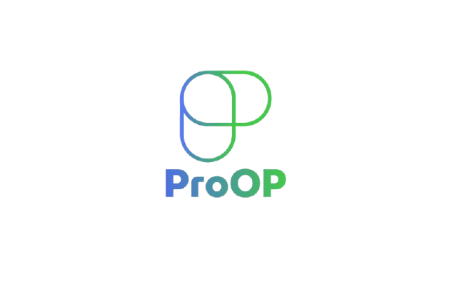
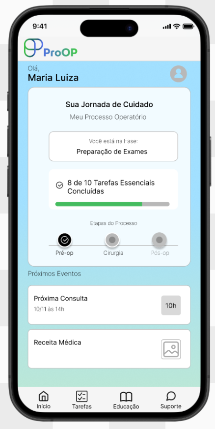

<div style="text-align:center">
  
</div> <br>
> [!NOTE]
> Este projeto faz parte da iniciativa Kickoff, focada na aplicação de metodologias de Design Thinking para a concepção e prototipagem de uma solução inovadora na área de Saúde e Bem-Estar.

# :exclamation:Problema

Pacientes cirúrgicos e cirurgiões enfrentam o risco da comunicação ineficaz no 
acompanhamento. Essa falha é a causa-raiz de 70% dos erros em saúde (IBSP), 
atrasa o tratamento em 40% dos casos e em alguns casos é fatal.

# :bulb:ProOp

A plataforma de gestão de risco cirúrgico. Centralizamos a comunicação e automatizamos todo 
o acompanhamento com checklists de cuidados personalizados, monitorando o paciente em 
tempo real para evitar falhas, atrasos e complicações no processo.



## 🌍 Acesso ao protótipo

Para começar a testar o protótipo, basta acessar o [link](https://www.figma.com/proto/XkWkkSdoGy51b36vZMYfQ6/Kickoff---Squad-9?node-id=35-333&t=tuqSVzGwf3VhKILw-1).

```
https://www.figma.com/proto/XkWkkSdoGy51b36vZMYfQ6/Kickoff---Squad-9?node-id=35-333&t=tuqSVzGwf3VhKILw-1
```
## :wrench: Funcionalidades
O protótipo foi criado para acompanhar o paciente durante o processo operatório, trazendo segurança, controle e satisfação. Pensando nisso, reunimos uma série de funcionalidades essenciais que vão guiar o paciente de forma eficiente, organizada e infomativa. Conheça abaixo tudo o que você pode aproveitar por aqui:

| **Funcionalidade**  | **Descrição**                                                                                                       |
| ------------------- | ------------------------------------------------------------------------------------------------------------------- |
| **:clipboard: Tarefas** | Tarefas para serem realizadas durante o dia como troca de curativo.                      |
| **:pill: Medicamenos**      | Informação de medicamentos que deverá tomar durante o dia (horário e quantidade).          |
| **:book: Educação**       | Conteúdos informativos, registro de relato, etapas do procedimento cirúrgico.        |
| **:telephone_receiver: Suporte**     | Chat de suporte digital, telefones (médico, enfermeiros disponíveis e atendimento).       | 


## 🛠️ Metodologia Aplicada
Design Thinking: Guiou o processo desde a empatia até o protótipo.  
Mapa de Empatia: Utilizamos esta ferramenta para aprofundar o entendimento das dores, necessidades e desejos do nosso público-alvo (Usuário Persona).  
Matriz CSD (Certezas, Suposições, Dúvidas): Essencial para validar as hipóteses iniciais e orientar a pesquisa de forma eficiente, mitigando riscos antes da fase de desenvolvimento.  
